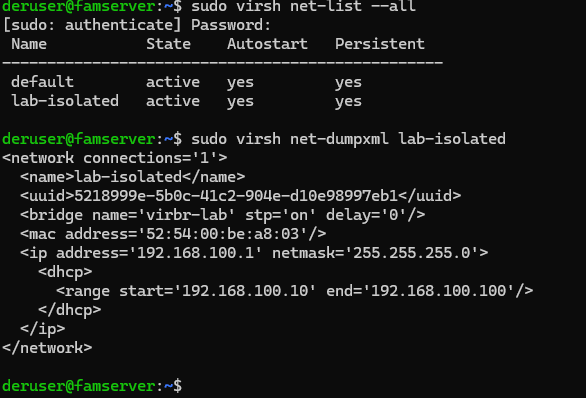
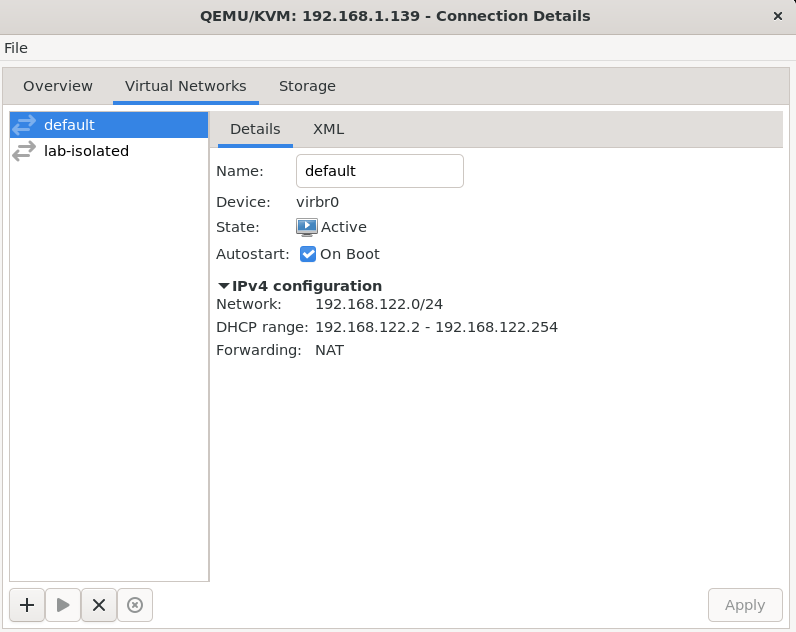
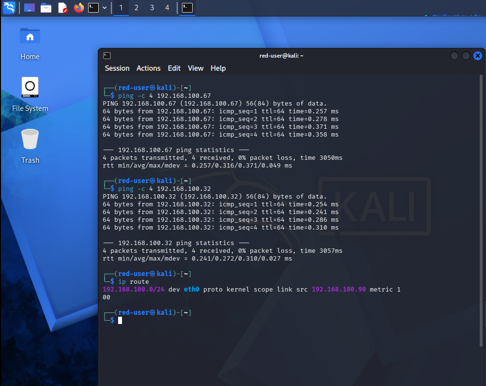
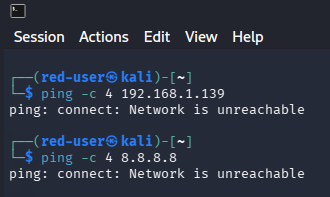
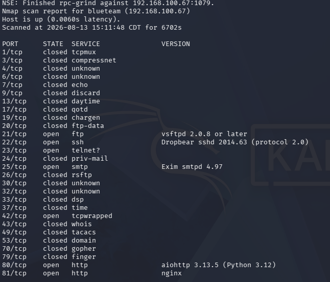
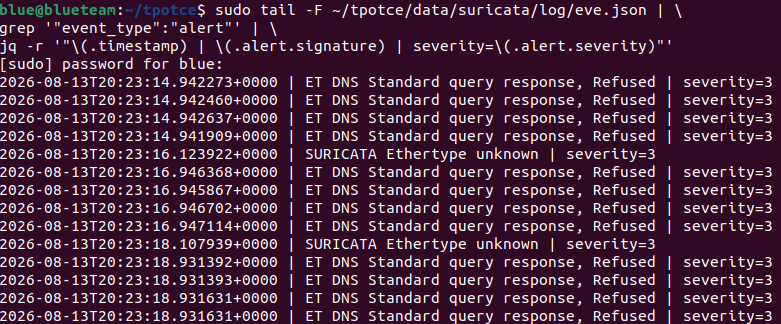
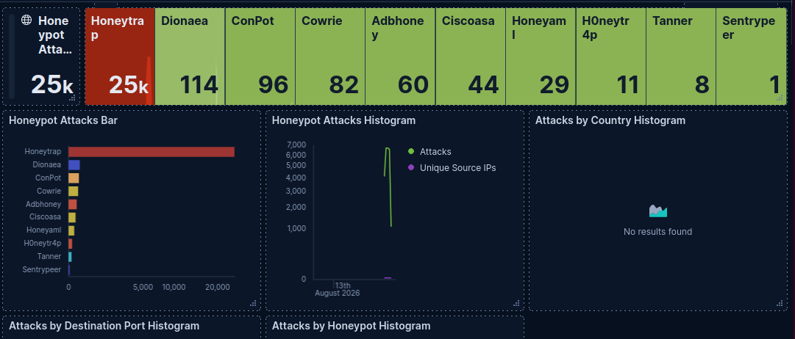

# T-Pot Honeypot Security Lab — Technical Documentation

## 1. Project Overview

The goal of the lab was to recreate a realistic setting of an attacker trying to scan exposed networks and using t-pot to help analyze the attack through a hands on setting

## 2. Lab Environment

### 2.1 Host Server

- Operating System: Ubuntu Server 26.04 LTS
- CPU: AMD Ryzen 7 5700G with Radeon Graphics
- RAM: 32 GB
- Storage: 930 GB
- Virtualization Platform: KVM/libvirt

### 2.2 Virtual Machines

| VM | OS | CPU | RAM | Storage | Purpose |
|---|---|---|---|---|---|
| Kali Linux | Kali Linux | 2 Cores | 4096 MB | 30GB | Reconnaissance |
| T-Pot | Ubuntu Server 24.04 | 5 Cores | 14000MB | 128GB | Honeypot |
| Ubuntu Desktop | Ubuntu Desktop | 2 Cores | 4096MB | 40GB | Kibana analysis |
## 3. Network Architecture

### 3.1 KVM/libvirt Network

A dedicated isolated network was created using KVM/libvirt to separate the cyber-security lab from the home network to prevent problems of accidental exposure to the internet.

The network was created using the libvirt network and named `lab-isolated` and attached to a virtual bridge named `virbr-lab`

The network uses the 192.168.100.0/24 subnet with 192.168.100.1 as the gateway. The address range for the network was from 192.168.100.10 to 192.168.100.100. However, no NAT was configured for this virtual network to provide secure network-level isolation, and there was no available path to the home LAN or internet.

Network:       lab-isolated
Bridge:        virbr-lab
Subnet:        192.168.100.0/24
Gateway:       192.168.100.1
DHCP range:    192.168.100.10 - 192.168.100.100
STP:           Enabled
NAT:           None configured

### 3.2 Network creation

The isolated network was created using the `virsh` network management utility. The network was configured with a dedicated bridge, subnet, and DHCP range. The network was enabled to automatically start on startup with the host machine

The network created was verified using 
``` bash
sudo virsh net-list --all
```
The network config can also be verified using 
``` bash
sudo virsh net-dumpxml <network-name>
```

### 3.3 IP Addressing

| System | IP Address | Role |
|---|---|---|
| Kali Linux | 192.168.100.90 | Attacker |
| T-Pot | 192.168.100.67 | Honeypot |
| Ubuntu Desktop | 192.168.100.32 | Analysis |
```text
                     Host Server
                  192.168.1.139
                         |
                    KVM/libvirt
                         |
                         X 
                    Network Isolation
                         |
                  virbr-lab
               192.168.100.1
                         |
                  lab-isolated
               192.168.100.0/24
                         |
          +--------------+--------------+
          |              |              |
          |              |              |
     Kali Linux         T-Pot       Ubuntu Desktop
   .100.90             .100.67        .100.32
   Red Team            Honeypot        Analysis
```
## 4. VM Deployment

### 4.1 Installation

During installation of all three VMs, it was temporarily using the default `virbr0` network to provide internet access during installation. This allowed the ability for each VM to obtain and complete necessary updates and packages before being moved onto the isolated network.



After installation and configuration on each VM was complete, the default network was removed from each VM. Afterward, a new virtual network interface was created and connected to the `lab-isolated` network. If not deleted and rather configured the original network interface to the `lab-isolated` network, the VM would not receive an IP and could not interact with the other VMs on the `libvirt` network.

### 4.2 Network Troubleshooting

An issue occurred during the attempt to reconfigure the virtual network interface from the original default virbr0 to the `lab-isolated` network.

When changing the network on the virtual network interface from `default` to `lab-isolated`, the VM failed to obtain an IP address on the new network. The workaround was removing the virtual network interface and creating a new interface that was configured to `lab-isolated`. This solved the issue.

This was able to show the importance of verifying virtual network configuration when moving a VM between networks.

### 4.3 Network Verification
    
To verify the connection of the three VMs, look for the IP in the virtual network interface on KVM/libvirt or use `ip route` in the console to find the subnet and the ip address. After doing so, I pinged each VM from Kali Linux to verify they were on the `lab-isolated` network. Another test I tried to verify the network was isolated from the internet and the home LAN was pinging both Google's network `8.8.8.8` and the host server `192.168.1.139`; this test is expected to fail.

 
 

These results verify the network is connected to each VM while segmented from the internet and the home LAN.

Commands used:

```bash
ping -c 4 192.168.100.67
ping -c 4 192.168.100.32
ping -c 4 8.8.8.8
ping -c 4 192.168.1.139
```
### 4.4 T-pot Troubleshooting
Upon T-Pot reboot and after pulling the necessary images for the containers to be fully operational, several containers experienced startup issues. The issues that we faced us apperently was that Suricata repeatedly restarted during initialization, and the T-pot dashboard was inaccessible. The issue that was causing this was related to the network configuration on the isolated network.

Due to the `lab-isolated` network being intentionally made to be configured to not have internet access, there was no default gateway available to T-Pot during startup. Several containers inside of T-Pot appeared to require a default route during boot up, which resulted in repeated restarts for multiple containers due to no route being present.

The workaround used was configuring a temporary default route that points to `192.168.100.1` on the t-pot VM. After restarting the t-pot application and checking for restarts, no restarts happened after the reboot of the application.

The temporary solution is due to the default route not being persistent across a reboot or shutdown, meaning the default route needs to be manually set to `192.168.100.1` after startup every time, or find a permanent solution.

After the service was restored, the dashboard of T-pot returned an HTTP Unauthorized response and booted us out of entering a username and password. After testing locally with `curl -k -I https:127.0.0.1:64297` the response showed a 401 unauthorized error. We went and found the authentication file, reset the password, and restarted Nginx (the reverse proxy/authentication layer that provides access to the Kibana dashboard). After doing so, we tested and were able to log in successfully.

commands used:
to check routing problem/default gateway
```bash
ip route
```
to check if Kibana was working correctly
```bash
docker ps -a --format "table {{.Names}}\t{{.Status}}"
```
to find the password authentication file
```bash
docker inspect nginx --format \
'{{range .Mounts}}{{println .Source " -> " .Destination}}{{end}}' | grep nginxpasswd
```
Make a new password inside the authentication file (bad password)
```bash
sudo htpasswd -b ~/tpotce/data/nginx/conf/nginxpasswd admin admin
```
## 5 Port Scanning Analysis
The lab that was executed was Kali Linux performing a reconnaissance scan on the IP address of the T-Pot honeypots VM. This is to simulate an attacker trying to find exposed ports and services on the targeted system and how that would look from the defender's POV as well.
### 5.1 Nmap scan
The Kali Linux VM performed an Nmap service and version detection scan against the T-pot VM at `192.168.100.67`

The command used on Kali Linux was:
```bash
nmap -sV 192.168.100.67
```



### 5.2 Suricata detection
After the attack was initialized and began scanning, Suricata detected the reconnaissance traffic and was able to log the occurring scans as alerts in the `eve.json` file

The command used to see Suricata event logs update in real time was:
```bash
sudo tail -F ~/tpotce/data/suricata/log/eve.json | \ grep '"event_type:"alert"'
```

The scan used by Kali generated thousands of Suricata alerts as traffic made its way into the honeypot.

These Event logs demonstrate that the attack itself was reaching the T-pot VM and was actively being monitored by the containers.


## 5.3 Result
The lab that was constructed created a clear detection pipeline from the reconnaissance to the defensive analysis:
Kali Linux
    |
Nmap service/version scan
    v
T-Pot Honeypot
    |
Network traffic
    v
Suricata
    |
Security events
    v
T-Pot Logging
    |
    v
  Kibana
    |
    v
Security Analysis

The scan performed inside the isolated network worked as intended as well and showed that the Kali VM could communicate with the other VMs inside the virtual network without being touched by outside influences like the home LAN or internet. Suricata successfully generated the alerts and Kibana showed the alerts as well in a sleek dashboard, all while being offline in a closed environment. Giving the ability to have a thorough analysis in a closed environment.
