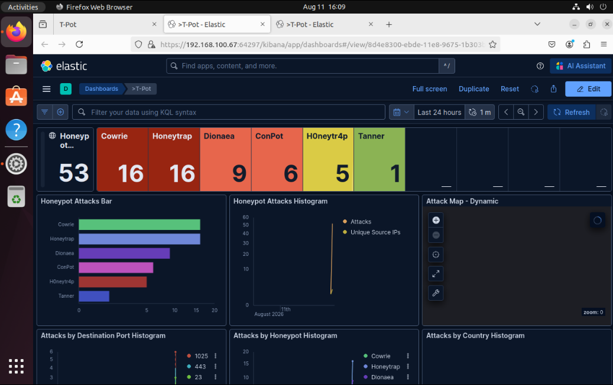
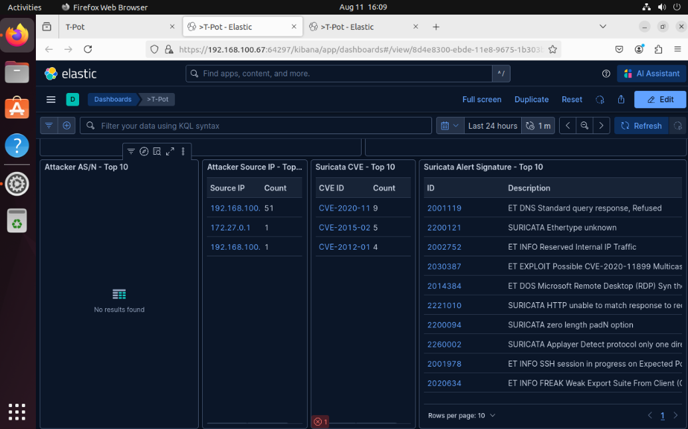

# T-Pot Honeypot Security Lab
Made by Derick Harrell & Daniel Harrell
## Overview
This project was designed to provide an isolated and secure virtual playground to learn reconnaissance tools, like Nmap on Kali Linux, and see how those tools are captured on a honeypot and can be analyzed.

The lab was built using VMware and consists of 3 VMs: 
Kali Linux
Ubuntu Server 24.04 hosting T-Pot
ubuntu desktop

Kali Linux was used to generate a controlled network scan across the network; the T-Pot server was used to pick up that traffic. Ubuntu Desktop was used to display the traffic using Kibana on a monitoring platform.

The entire project was hosted on a personal server using Ubuntu 26.04 LTS on a dedicated virtual network to prevent simulated attacks from affecting the home network.
## Objectives
-Build an isolated virtual network
-Deploy and troubleshoot t-pot
-Use Nmap on Kali Linux to produce traffic across the network
-Analyze the traffic using Kibana on the virtual desktop
-document the detection and analysis process
## Lab Architecture
```text
                    Host Server
                        |
                VMware Virtual Network
                        |
          +-------------+-------------+
          |             |             |
          v             v             v
      Kali Linux      T-Pot       Ubuntu Desktop
      (red-team)     Honeypot        Analysis
                   (blue-team)
```
## Technologies Used
Linux 
    Ubuntu desktop
    Ubuntu 26.04 server
    Kali linux
VMware
KVM
Nmap
Kibana
Suricata
T-Pot
Docker
SSH
T-Pot
WireGaurd(in progress)
## Testing
Controlled TCP port scanning was performed by a Kali Linux VM against the T-Pot VM

Suricata detected the traffic and then displayed and analyzed the attacks through a Kibana dashboard
## Results
The T-Pot VM successfully detected and recorded activity generated from the TCP port scans made by the Kali Linux VM

Events that were generated produced visible security events on the monitoring dashboard and produced the source address, timestamp of the security event, along with the signature of the attack itself. 


## Lessons Learned
This lab was able to deliver hands-on experience with
    -Linux system administration
    -Virtual networking
    -troubleshooting network configuration
    -Network reconnaissance
    -security event analysis
    -log visualisation
    - Docker-based security infrastructure
    -honeypot script configuration/troubleshooting
